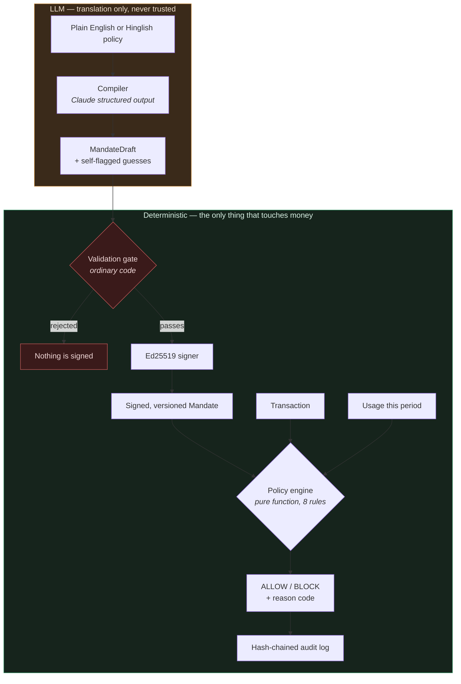

# Mandate Compiler

**A seatbelt for AI agents that spend your money.** It doesn't stop them from
driving — it stops them from crashing.

You tell an agent, in plain English, what it may spend on your behalf:

> *"Let my agent buy groceries, up to ₹2,000 per week, only from Zepto, Swiggy
> or BigBasket, no alcohol, and only between 6am and 11pm."*

This compiles that sentence into a signed, machine-checkable **mandate**, then
enforces every single transaction against it with deterministic code — never an
LLM — and records every decision in a tamper-evident log you can verify
yourself.

---

## The gap this fills

NPCI's **UAP**, Google's **AP2**, OpenAI/Stripe's **ACP**, and Coinbase's
**x402** are all racing to answer the same question: *is this agent authorized
to transact?*

None of them rigorously answer the next one:

> **Does this specific payment actually match what the human meant when they
> granted that authorization — and can anyone verify that afterwards?**

An agent with a valid credential and a broad grant is still an agent that can
buy the wrong thing, from the wrong merchant, at the wrong hour. This project
is the policy-compilation-and-enforcement layer that sits *under* any of those
protocols and closes that gap.

---

## The core design principle

**The LLM translates. It never enforces.**

You cannot trust a language model to gate money movement — so it doesn't. Its
only job is turning English into a structured policy. A deterministic,
non-LLM engine decides whether each payment is permitted.



Everything inside the green box is auditable code with no network calls, no
model, and no judgment. The orange box can be wrong — and the gate between them
exists because it *will* eventually be wrong.

---

## Quick start

```bash
python3 -m venv .venv && source .venv/bin/activate
pip install -r requirements.txt
uvicorn app.main:app --reload            # http://localhost:8000
```

The compiler needs `ANTHROPIC_API_KEY`. Everything else — engine, signing,
audit chain, simulator, revocation — runs without it, and the dashboard reports
the compiler as unavailable rather than failing.

```bash
python -m pytest tests/ -q                       # 262 tests
python scripts/generate_data.py --verify         # 275 labelled txns vs the engine
python scripts/eval_compiler.py                  # 15 NL cases (needs API key)

MANDATE_DEMO_TAMPER=1 uvicorn app.main:app       # enables the tamper demo
```

---

## How it works

### 1 · Compiler — and the gate that distrusts it

[`app/compiler.py`](app/compiler.py) is the only place an LLM appears. It emits
a `MandateDraft`, which is **not trusted**. `validate_draft` bounds-checks every
field in ordinary code before anything can be signed:

- caps positive and under a compiler ceiling
- per-transaction cap ≤ period cap
- times well-formed 24-hour `HH:MM`
- allowlist non-empty (an empty one blocks all spending — fail loudly, not
  silently)
- no merchant that is also an excluded category

A hallucinated `₹99,999,999` cap is caught here, so it stays a *translation*
bug instead of becoming a *spending* bug.

The model is also required to **flag its own guesses**. Any field the sentence
left open comes back in `ambiguities` with a clarifying question. Under-flagging
is treated as a failure by the eval, even when the guessed value looks sane.

Money is stored in **paise** (integer minor units) throughout, matching
Razorpay's convention. The model emits rupees; the conversion happens in code,
so the model never does arithmetic.

### 2 · Engine — boring on purpose

[`app/engine.py`](app/engine.py) is a pure function of
`(Mandate, Transaction, Usage)`. No LLM, no network, no database. Eight rules
in fixed precedence, first failure short-circuits:

```
status → validity_window → amount_cap_per_txn → merchant_allowlist
       → category_exclusions → time_window → amount_cap_period → frequency_cap
```

Order is part of the contract. A revoked mandate always reports
`MANDATE_REVOKED`, never a downstream reason like `AMOUNT_CAP_EXCEEDED`, so the
audit trail stays stable and explainable. Eleven reason codes; every decision
carries one, plus the rule that triggered it and a human-readable detail.

Only **allowed** transactions consume budget — a blocked attempt moves no money,
so a burst of rejected attempts can't starve legitimate spending.

### 3 · Signing — and what the signature deliberately excludes

[`app/signing.py`](app/signing.py) signs the **grant terms** with Ed25519:
principal, agent, caps, allowlist, exclusions, window, validity, and `version`.

It deliberately does **not** cover `status`. That's a design choice, not an
oversight. Including it would mean either revocation invalidates the signature
(making a revoked mandate indistinguishable from a forged one), or re-signing on
every transition (eroding the signature's meaning as an attestation of the
original grant).

So the two mechanisms split the work:

| Mechanism | Makes tamper-evident |
|---|---|
| Ed25519 signature | the granted terms |
| Audit chain | status transitions |

Neither alone is sufficient. Edited terms fail signature verification; a mandate
silently flipped from revoked back to active leaves the chain without a matching
event.

### 4 · Audit chain

Every entry — decisions *and* mandate lifecycle events — links to the one
before it:

```
audit_hash(n) = SHA256(canonical({ …entry n…, prev_hash: audit_hash(n-1) }))
```

Because `prev_hash` sits *inside* the hashed payload, altering any entry changes
its own hash and orphans everything after it.


`seq` is a monotonic integer rather than a UUID precisely so a *missing* entry
is detectable — a gap is evidence of deletion, which a UUID key could not
express. Canonical JSON ([`app/canonical.py`](app/canonical.py)) keeps the bytes
stable: sorted keys, no insignificant whitespace, ASCII-escaped, naive-UTC
timestamps.

### 5 · Simulation and revocation

**Revocation takes effect on the very next transaction.** The simulator re-reads
mandate state from the database for every single transaction, opening a
short-lived session each iteration. Caching the mandate once at the top of the
loop is the obvious optimisation and would quietly break the guarantee the whole
system exists to make — a kill switch that only engages at the next batch
boundary is not a kill switch.

Verified against a real server: revoke issued 1.55s into a 9.2s stream, 45
decisions before it, **226 after, every one `MANDATE_REVOKED`**.

---

## How do you know it works?

Three independent kinds of evidence, because "the tests pass" is a weak claim on
its own.

**262 unit tests.** Every rule, every boundary, every tamper scenario.

| Module | Tests | Module | Tests |
|---|---|---|---|
| `test_failure_handling.py` | 44 | `test_audit.py` | 27 |
| `test_engine.py` | 40 | `test_simulator.py` | 23 |
| `test_compiler.py` | 38 | `test_dataset.py` | 15 |
| `test_signing.py` | 35 | `test_usage.py` | 6 |
| `test_api.py` | 34 | | |

**A 275-transaction differential test.** [`app/synthetic.py`](app/synthetic.py)
generates transactions with *exact* ground-truth labels;
[`tests/test_dataset.py`](tests/test_dataset.py) replays them through the real
engine. The generator imports no evaluation logic, so agreement is meaningful,
not tautological. Labels stay exact through one discipline: **every transaction
violates at most one rule**, so precedence never has to be reasoned about.

This caught three bugs the unit tests missed, all the same shape — a scenario
that *looked* like it tested one rule but tripped another. The subtlest:
stateful labels assigned in generation order while the engine evaluates in
timestamp order. Order-dependence is invisible to tests that check one rule at
a time.

**Mutation testing on the claim that matters most.** A test asserting
"revocation takes effect immediately" is worthless if it would also pass against
broken code. So I broke it deliberately: hoisting the mandate read out of the
simulator loop makes the test fail with **186 transactions slipping through**
after the revoke. Then I restored it.

---

## Two failures, handled

### The compiler isn't sure it understood

Ambiguity flags are load-bearing, not advisory. If the compiler guessed at a
term that **bounds how much money can move or where it can go** —
`merchant_allowlist`, `category_exclusions`, either amount cap, or `period` —
the mandate is created `pending_confirmation`: signed and stored, but *not
enforceable*. The engine blocks everything against it with
`MANDATE_NOT_CONFIRMED`.

The system declines to act on a policy it isn't confident it understood, rather
than guessing and hoping. Guesses about the time window or validity are recorded
but don't block — not every uncertainty is worth stopping the world for.

Resolution takes one of two audited paths:

- **Confirm** — accept the assumption. `MANDATE_CONFIRMED` enters the chain.
- **Amend** — correct the term. `version` bumps, the mandate is **re-signed**,
  `MANDATE_AMENDED` enters the chain. Because `version` is inside the signed
  payload, an amended mandate is cryptographically distinguishable from the
  original rather than quietly overwriting it.

The gate applies to humans too: a person resolving a guess still cannot write a
zero cap, an empty allowlist, or a per-transaction cap above the period cap.
`id`, `principal_id`, `status`, `version` and `signature` aren't amendable at
all — changing those would be a different grant, not a correction.

### Someone edits the audit log

```bash
MANDATE_DEMO_TAMPER=1 uvicorn app.main:app
```

Three attacks, each writing **raw SQL** directly to the database — the realistic
threat, and going through the ORM would maintain the chain and prove nothing.
Each produces a distinct detection:

| Attack | What verification reports |
|---|---|
| Flip a `BLOCK` to `ALLOW` | `content altered` at that entry |
| Delete an entry | `sequence gap: expected seq 16, found 17 (1 entry missing)` |
| Forge the hash after editing | `broken link` at the **next** entry |

The third is the interesting one. The attacker edits an entry *and* recomputes
its hash, so it now verifies against itself — and detection falls entirely to
the chain link from its successor, which still points at the old hash.

Verification reports the **first** break, so `POST /demo/reset` gives a clean
chain between attacks. Both demo endpoints register **only** under
`MANDATE_DEMO_TAMPER=1`, and the dashboard hides the panel unless `/health`
reports it enabled. A test asserts both are 404 by default.

---

## Honest limitations

These are real, and stated deliberately rather than left for someone to find.

**A full chain rewrite defeats the audit log.** An attacker who can write to the
database *and* recompute every hash forward from the point of tampering produces
a self-consistent chain. Detection needs the head hash anchored somewhere they
can't reach — published, counter-signed, or written to append-only storage.
`chain_head` exists for exactly that; the anchoring does not.

**Tail truncation is undetected.** Deleting the *last* entries leaves no
sequence gap. Same fix, same gap. There is a test asserting this honestly rather
than pretending otherwise.

**The schema can't express every policy a human might write.** Day-of-week
constraints ("weekends only") and category *allowlists* ("household items,
nothing else") have no representation. The compiler is instructed to flag the
dropped constraint rather than silently discard it, and the eval corpus contains
both cases — but a flagged-and-dropped constraint is still a dropped constraint.

**The compiler's real-world accuracy is unmeasured.** The eval harness and its
15-case corpus (Hinglish, shorthand amounts, midnight-crossing windows) are
written and their logic is verified against stubs, but they have not been run
against the live model — no API key was available in the build environment.
Expect to iterate on the system prompt. The *gate* that bounds the compiler is
fully tested and does not depend on model quality.

**Dev signing keys live on disk** in a gitignored `.signing_key`. Production
would put the private key in an HSM or KMS behind an authenticated service
boundary.

**Single-node SQLite, no authentication.** There is no authn/authz on any
endpoint; anyone who can reach the service can revoke a mandate. Fine for a
test-mode demo, nowhere near production. The audit-verify endpoint is
unauthenticated *by design* — the point of a tamper-evident log is that anyone
can check it.

**This is not connected to real payment rails.** It enforces against synthetic
transactions. Integrating with UPI/UAP is future work and gated on RBI approval.

---

## How this maps to the judging bar

> *"Every money action explainable, bounded and gated. Show the audit trail and
> one failure handled gracefully."*

| Requirement | How |
|---|---|
| **Explainable** | Every decision carries a structured reason code, the rule that fired, and a human-readable detail. Never a vibe. |
| **Bounded** | Hard caps enforced by a pure function. The LLM is never in the enforcement path, and a validation gate bounds the LLM itself. |
| **Gated** | Validity window, live revocation effective on the next transaction, and unconfirmed mandates that fail closed. |
| **Audit trail** | Hash-chained log covering decisions *and* lifecycle events, with an unauthenticated verification endpoint. |
| **One failure handled** | Two: low-confidence compilation asks instead of guessing, and audit tampering is caught three different ways. |

---

## Project layout

```
app/
  compiler.py    NL → MandateDraft (the only LLM call) + validation gate
  engine.py      pure decision function, 8 rules, 11 reason codes
  usage.py       period accumulation (kept out of the engine to keep it pure)
  signing.py     Ed25519 over grant terms
  canonical.py   byte-stable serialization for signing and hashing
  audit.py       hash chain: append, verify, report first break
  amend.py       confirm / amend a flagged mandate, re-sign, re-audit
  simulator.py   batch replay, re-reading mandate state every transaction
  synthetic.py   275 labelled transactions with exact ground truth
  tamper.py      deliberate attacks (demo scaffolding, gated off by default)
  main.py        FastAPI: 16 endpoints incl. SSE streaming
  templates/     single-page dashboard, zero external resources
scripts/
  generate_data.py   generate / export / verify the dataset
  eval_compiler.py   15-case NL compiler eval
  demo_chain.py      end-to-end: sign, decide, tamper, detect
tests/             262 tests
```

Roughly 2,500 lines of application code and 2,500 lines of tests.

---

## What's next

- Anchor the chain head externally (publish or counter-sign) to close the
  full-rewrite gap
- Run and tune the compiler eval against the live model
- Day-of-week and category-allowlist support in the schema
- Real UAP integration once RBI approval lands
- Multi-agent mandates: one principal, several agents, shared budget
